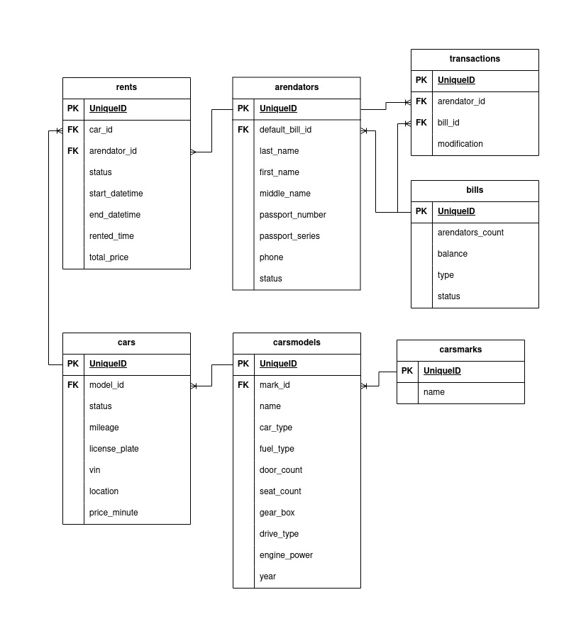

## Запуск проекта

1. Установка зависимостей Composer
```sh
composer i
```

2. Запуск Laravel Sail
```sh
./vendor/bin/sail up
```

3. Вход в контейнер Laravel
```sh
docker exec -it laravel bash
```

4. Запуск миграции таблиц БД
```sh
php artisan migrate --seed
```

5. Установка зависимостей NPM
```sh
npm i
```

6. Запуск Vite
```sh
npm run dev
```

## Swagger

Опубликовать конфигурацию [L5-Swagger](http:localhost/api/documentation)
```sh
php artisan l5-swagger:generate
```

## ER диаграмма базы данных



### cars
- model_id - идентификатор модели ТС
- status - статус ТС
- mileage - пробег ТС
- license_plate - регистрационный знак ТС
- vin - идентификационный номер ТС
- location - местоположение ТС
- price_minute - цена аренды в минуту

### carsmodels
- mark_id - идентификатор бренда
- name - название модели
- car_type - тип кузова
- fuel_type - тип топлива
- door_count - количество автомобильных дверей
- seat_count - Количество пассажирских мест
- gear_box - тип коробки передач
- drive_type - вид привода
- engine_power - мощность двигателя
- year - год выпуска

### carsmarks
- name - название марки ТС

### rents
- car_id - идентификатор ТС
- arendator_id - идентификатор арендатора
- status - статус аренды
- start_datetime - время открытия аренды
- end_datetime - время закрытия аренды
- rented_time - время аренды
- total_price - итоговая цена за аренду

### arendators
- default_bill_id - идентификатор счета
- last_name - фамилия арендатора
- first_name - имя арендатора
- middle_name - отчество арендатора
- passport_number - номер паспорта
- passport_series - серия паспорта
- phone - телефон арендатора
- status - статус аккаунта

### transactions
- arendator_id - идентификатор арендатора
- bill_id - идентификатор счета
- modification - изменение баланса

### bills
- arendators_count - количество пользователей связанных со счётом
- balance - баланс счета
- type - тип счета
- status - статус счета