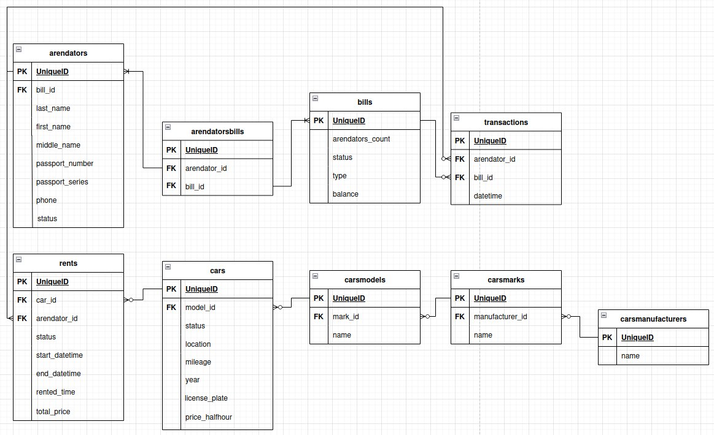

## Установка

- Установите зависимости Composer (`composer update`);
- Запустите проект (`sail up` для Windows) или (`./vendor/bin/sail up` для Linux);
- Заполните данными таблицы (`sail artisan migrate --seed` для Windows) или (`php artisan migrate --seed` для Linux).
- Используйте `npm run dev` в контейнере laravel

Если некоторые команды не работают, то их необходимо запускать внутри контейнера laravel

## Swagger

Для создания или обновления данных в [SwaggerUI](http:localhost/api/documentation) используйте `php artisan l5-swagger:generate`

## ER диаграмма базы данных

